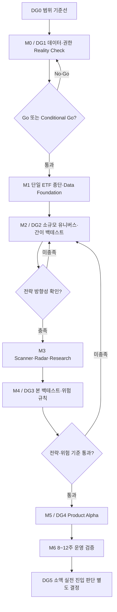

# ETF 투자 가이드 MVP 개발 로드맵 — 역사적 스냅샷 (v1.7로 대체됨)

> **상태:** 이 문서는 이전 P0-01~10 제품 방향의 실행 기록이며 현재 실행 상태의 정본이 아니다. 현행 정본은 `docs/ROADMAP-v1.7.md`, 현행 프로그램 계획은 `docs/superpowers/plans/2026-09-14-etf-price-signal-mvp-v17-program.md`다.
>
> 기존 Task 001~014 완료·Conditional Go·DG2~DG4 상태는 v1.7의 Gate 통과 또는 구현 완료를 뜻하지 않는다. 역사적 증거는 보존하되 v1.7에 재사용하려면 DG0 매핑과 새 Gate 증거가 필요하다.

> 버전: v1.0  
> 작성일: 2026-08-25  
> 최종 업데이트: 2026-09-10<br>
> 상태: Gate Evidence Readiness Complete — 구현 완료와 Gate 승인을 분리하고, 현재 접근 불가 증거는 재개 조건까지 연기
> Machine gate status: DG2 Conditional Go / DG3 No-Go / DG4 No-Go / Forward Validation Not Started
> 실행 원장: `docs/plan/gates/DG2-evidence-input.template.json`, `DG3-evidence-input.template.json`, `DG4-evidence-input.json`
> 제품 요구사항 권위 문서: `docs/PRD.md`
> 원천 실행 계획: `docs/plan/ETF_MVP_이후_진행_흐름_v0.1.md`
> Gate 증거 위치: `docs/plan/gates/DG{번호}-{주제}.md`

## 1. 목적

이 문서는 `docs/PRD.md`의 P0-01~P0-10을 구현·검증하기 위한 **실행 순서·일정·완료 증거의 권위 문서**다. 원천 실행 계획을 Task와 Gate로 구체화하며, 의존성, 마일스톤, Go/No-Go Gate와 완료 증거를 정의한다. 일정은 Gate 통과를 전제로 하며, 주차가 지났다는 이유만으로 다음 단계에 진입하지 않는다.

## 2. 운영 원칙

1. **데이터 우선:** DG1을 통과하기 전 UI 본개발과 영구 스키마 확정을 시작하지 않는다.
2. **종단 우선:** 전체 유니버스보다 대표 ETF 한 개의 Raw → 정규화 → 계산 → 추천 → 화면 흐름을 먼저 완성한다.
3. **조기 검증:** W3 간이 백테스트에서 전략 변별력이 없으면 W4 이후 기능 개발보다 입력과 스코어카드를 먼저 수정한다.
4. **버전 격리:** 전략, 유니버스, 벤치마크와 계산 방식의 버전을 과거 결과와 섞지 않는다.
5. **시점 정합성:** 모든 입력과 판단은 `as_of`를 가지며 미래 정보를 참조하지 않는다.
6. **증거 기반 완료:** 코드 작성이 아니라 Acceptance Criteria, 테스트와 산출물 위치가 확인될 때 Task를 완료한다.
7. **0원 검증:** DG5 전까지 실제 투자금 투입과 자동주문을 범위에서 제외한다.

## 3. 전체 단계



## 4. Gate 정의

| Gate                    | 목표 시점    | 필수 증거                                                                   | Owner (담당) | Approver (승인) |
| ----------------------- | ------------ | --------------------------------------------------------------------------- | ------------ | --------------- |
| DG0 범위                | 착수 전      | PRD v1.0, 목표 시장, 비목표, Open Questions                                 | 제품 책임자  | 검토자          |
| DG1 데이터·권한         | W1           | 한·미 각 5개, 필드 매핑, 개인 내부 사용 경계, 원본·정규화, 오류·재시도 로그 | 제품 책임자  | 검토자          |
| DG2 전략 방향성         | W3           | 정확히 30개 적격 ETF 간이 백테스트, 전략 구분, 컷·필터 민감도               | 제품 책임자  | 검토자          |
| DG3 전략·위험           | W6           | 3~5년 롤링 백테스트, 하락장, 비용·위험·교체 분석                            | 제품 책임자  | 검토자          |
| DG4 제품 알파           | W8           | P0 종단 흐름, 재현성, 발행 차단, 복구, 내부 QA                              | 제품 책임자  | 검토자          |
| DG5 소액 실전 진입 판단 | 운영 검증 후 | 8~12주 안정성, 세후·비용 재계산, 6개월 전향검증 계획                        | 제품 책임자  | 검토자          |

모든 Gate 문서는 `docs/plan/gates/` 아래에 `DG{번호}-{주제}.md` 형식으로 저장한다. 판정 기록 필드와 Owner/Approver 역할 정의는 `docs/PRD.md` 11장을 따른다.

> **일정 주석 — 원천 계획 대비 변경:** 원천 실행 계획(`docs/plan/ETF_MVP_이후_진행_흐름_v0.1.md`)이 가정한 DG2 W2 시점은 Task 004→005→006→007→008의 순차 의존성상 달성할 수 없다. 본 로드맵은 DG2를 W3로 조정하며, 이 문서의 일정이 원천 계획의 오래된 W2 가정을 대체하는 현재 권위 기준이다.

## 5. 마일스톤 요약

| 마일스톤                 | 주차    | 목표                                        | 관련 PRD            |
| ------------------------ | ------- | ------------------------------------------- | ------------------- |
| M0 — API Reality Check   | W1      | 데이터 범위·권한·정확도 확정                | P0-01, P0-03        |
| M1 — Data Foundation     | W1~W2   | 단일 ETF 종단, 마스터·가격·환율·분배금 기반 | P0-01~P0-03         |
| M2 — Strategy Validation | W2~W3   | 소규모 간이 백테스트와 전략별 점수          | P0-04, P0-05, P0-09 |
| M3 — Scanner & Research  | W4~W5   | 전체 Scanner, Radar, 리서치와 가이드 근거   | P0-05~P0-07         |
| M4 — Backtest & Risk     | W6      | 롤링 백테스트, 포트폴리오와 위험 규칙       | P0-08~P0-10         |
| M5 — Product Alpha       | W7~W8   | 제품 화면, 종단 QA와 DG4 판정               | P0-01~P0-10         |
| M6 — Forward Validation  | W9 이후 | 8~12주 운영 안정성과 실전 전환 준비         | P0-07~P0-10         |

M1(Task 004→005→006)은 W2 말에 완료하고, M2(Task 007→008)는 W2 후반에 시작해 W3에서 DG2로 종료한다. M1과 M2의 주차 중첩(W2)은 Task 007이 Task 006 완료 이후에만 시작함을 전제하며, 동시 병렬 착수를 의미하지 않는다.

## 6. Phase 0 — 기준선과 Reality Check

### Task 001: 제품 기준선 동결 — 최우선

**상태:** 완료 (Completed) — Gate 판정 기록: `docs/plan/gates/DG0-scope-baseline.md`
**의존성:** 없음  
**완료 Gate:** DG0

- `docs/PRD.md` v1.0의 목표 시장, 전략, 사용자, 비목표와 P0-01~P0-10 검토
- 한국·미국 동시 목표와 시장별 `Conditional Go` 규칙 확인
- 자동매매, 실계좌 주문, 레버리지·인버스 기본 추천 제외 확인
- Open Questions의 책임자와 확정 Gate 지정
- 변경 요청을 Post-MVP 또는 PRD 버전 변경으로 분리

**완료 증거**

- 승인된 PRD 버전과 DG0 판정 기록
- 미확정 질문 목록과 책임자

### Task 002: Kiwoom 인증·호출 Reality Check — 최우선

**상태:** 완료 (Completed) — DG1은 한국 시장 한정 Conditional Go이며, Task 003은 완료됨
**의존성:** Task 001  
**완료 Gate:** DG1 일부

- 실계정 접근토큰 발급, 만료와 재발급 검증
- 국내·미국 ETF 목록 API 호출 및 ETF·ETN 구분
- 한국·미국 ETF 각 5개 이상의 일봉 수집
- `cont-yn`, `next-key` 연속조회 검증
- 호출 제한, 타임아웃, 재시도와 중복 요청 동작 기록
- Mock 응답과 실데이터 응답 차이 기록

**완료 증거**

- 인증 헤더, API 키, Bearer 토큰, 쿠키와 계정 식별자가 제거된 요청·응답 샘플
- API별 필드 매핑표
- 같은 자격 증명·식별자 제거 규칙을 적용한 오류·재시도·연속조회 실행 로그

**Task 002 부분 실행 증거 (2026-09-01)**

_인증_

- 실계정(real) 프로필 접근토큰 발급 및 만료 후 재발급 성공(2026-09-01). 토큰 값·헤더·쿠키·계정 식별자는 기록하지 않으며, 자격 증명은 OS 자격 증명 저장소에서 로드.

_미국 ETF/ETN 목록(`usa10104`)_

- 전체 5,646건 중 ETF 5,582건, ETN 64건 구분 확인.
- 일봉 수집 성공: AAAA, AAAU, AAOG, AAOX, AAOZ(5개 이상).
- 종목별 1페이지 일봉 행수: AAAA 100 / AAAU 100 / AAOG 78 / AAOX 100 / AAOZ 35.
- AAAA 2페이지 연속조회 결과 200행(1+2페이지 합산).

_한국 ETF 정보·일봉_

- 정보·일봉 조회 성공: 069500, 102110, 229200, 360750, 133690(5개 이상).
- 각 종목 1페이지 일봉 30행.
- 069500 2페이지 연속조회 결과 60행.

_국내 전종목 목록(`ka40004`)_

- 공식 스펙(`https://raw.githubusercontent.com/Kiwoom-Securities/Kiwoom-REST-API/main/kiwoom/_data/kiwoom_api_spec.json`, 확인일 2026-09-01) 확인 결과 `mngmcomp`는 필수 파라미터이며 `0000`이 "전체"를 의미함을 확정.
- `mngmcomp=0000` 호출로 전체 100행, `return_code=0` 성공 확인.

_연속조회(`cont-yn`/`next-key`)_

- AAAA(미국), 069500(한국)의 2페이지 결과 행수로 연속조회 동작을 간접 검증. 커서·헤더 값 자체는 기록하지 않음.

_오류 처리 관찰_

- 존재하지 않는 미국 종목코드 조회 시 JSON 응답 `return_code=7`(오류)이나 CLI 프로세스 종료 코드는 0. 호출자는 프로세스 종료 코드가 아니라 API `return_code`로 성공·실패를 판정해야 함.

_미확인·미해결 사항_

- 공식 스펙에 국내 `stk_cls` enum의 의미가 정의되어 있지 않음.
- Mock/Demo 프로필이 부재하여 Mock 응답과 실데이터 응답 차이 비교는 수행하지 못함.
- 호출 제한(rate-limit)·타임아웃을 의도적으로 유발하는 테스트는 수행하지 않음.
- 통상적인 타임아웃·rate-limit 상황의 재시도 동작은 실증적으로 검증되지 않음.

_결론_

- 위 항목 중 자격 증명이 제거된 요청·응답 샘플, API별 필드 매핑표, 자격 증명·식별자 제거 규칙을 적용한 오류·재시도·연속조회 실행 로그(위 "완료 증거" 참조), Mock 응답 비교, 의도적 오류·재시도·rate-limit 검증이 남아 있어 Task 002는 완료가 아니다. 소스별 권한·용도 매트릭스는 Task 003의 산출물이며 Task 002 완료 조건이 아니다. Task 003과 DG1 판정은 착수하지 않는다.

**Task 002 추가 증거 (2026-09-04)**

_API별 필드 매핑표_

| API ID     | 명칭                                        | 요청 필수/선택 필드                                                                                                | 응답 주요 필드                                                                                                                                                                         |
| ---------- | ------------------------------------------- | ------------------------------------------------------------------------------------------------------------------ | -------------------------------------------------------------------------------------------------------------------------------------------------------------------------------------- |
| `usa10104` | 미국 ETF,ETN 리스트                         | 선택: `stex_tp`(거래소구분)                                                                                        | `list[].stex_tp`, `code`, `cate1`, `cate2`, `etn`, `mkgb`, `upnm`                                                                                                                      |
| `ka40002`  | ETF종목정보요청 (한국 ETF 정보)             | 필수: `stk_cd`(종목코드)                                                                                           | `stk_nm`, `etfobjt_idex_nm`, `wonju_pric`, `etftxon_type`, `etntxon_type`                                                                                                              |
| `ka40003`  | ETF일별추이요청 (한국 ETF 일봉)             | 필수: `stk_cd`(종목코드)                                                                                           | `etfdaly_trnsn[].cntr_dt`, `cur_prc`, `pre_sig`, `pred_pre`, `pre_rt`, `trde_qty`, `nav`, `acc_trde_prica`, `navidex_dispty_rt`, `navetfdispty_rt`, `trace_eor_rt`, `trace_cur_prc` 등 |
| `ka40004`  | ETF전체시세요청 (국내 ETF 전체/전종목 목록) | 필수: `txon_type`, `navpre`, `mngmcomp`, `txon_yn`, `trace_idex`, `stex_tp`                                        | `etfall_mrpr[].stk_cd`, `stk_cls`, `stk_nm`, `close_pric`, `pre_sig`, `pred_pre`, `pre_rt`, `trde_qty`, `nav`, `trace_eor_rt` 등                                                       |
| `usa06012` | 미국주식 일 차트 (미국 ETF 일봉)            | 필수: `stex_tp`(거래소구분), 선택: `stk_cd`, `strt_dt`, `upd_stkpc_tp`(수정주가구분), `exrt_appl_tp`(환율적용구분) | `result_list[].dt`, `cur_prc`, `pred_pre`, `flu_rt`, `acc_trde_qty`, `acc_trde_prica`, `open_pric`, `high_pric`, `low_pric`, `upd_stkpc_tp`(수정주가구분), `upd_rt`(수정비율)          |

- 09-01 미국 일봉 수집(AAAA/AAAU/AAOG/AAOX/AAOZ)에 실제로 사용한 API는 `usa06012`(거래소구분 AMEX)이다. AAAA를 `--exchange NASDAQ`/`NYSE`로 재조회하면 `return_code=7`(종목 정보 없음)이 나고 `--exchange AMEX`로 조회해야 09-01 기록과 동일한 100행이 재현되어, 사용 API와 거래소 값을 이번에 특정했다.
- `upd_stkpc_tp`/`upd_rt`(수정주가 구분·수정비율) 필드는 응답에 존재하나, AAAA 100행 조회에서 `--adjusted 0`과 `--adjusted 1`을 각각 지정해도 두 값 모두 빈 문자열로 동일하게 관찰됨(해당 조회 구간에 수정 이벤트가 없었던 것으로 추정되며, 인과관계 자체를 확정 검증하지는 못함).

_요청·응답 샘플(자격 증명·계정 식별자 제거, 원시 전체 페이로드가 아닌 대표 발췌)_

- 국내(`ka40002`, 069500, 2026-09-04): 요청 `POST /api/dostk/etf`, 헤더 `api-id: ka40002`, `authorization: Bearer <REDACTED>`, 바디 `{"stk_cd": "069500"}`. 응답 전체(민감 필드 없음): `{"stk_nm": "KODEX 200", "etfobjt_idex_nm": "KOSPI200", "wonju_pric": "10", "etftxon_type": "비과세", "etntxon_type": "비과세", "return_code": 0, "return_msg": "정상적으로 처리되었습니다"}`.
- 미국(`usa10104`, 2026-09-04): 요청 `POST /api/us/stkinfo`, 헤더 `api-id: usa10104`, `authorization: Bearer <REDACTED>`, 바디 `{"stex_tp": "ND"}`. 응답은 다건 리스트이며 원문 전체를 기록하지 않고 대표 1건만 발췌: `{"stex_tp": "ND", "stk_cd": "AAAP", "cate1": "BCG-FXINC", "cate2": "FOCA-S1", "etn": "N", "mkgb": "NASDAQ", "upnm": ""}`.

_연속조회·재시도·중복 요청 재현(2026-09-04)_

- 연속조회 재현: `ka40003`(069500) 2페이지 호출 결과 60행(30행×2) — 09-01 관찰과 동일하게 재현됨.
- 토큰 재발급(재시도 경로) 재현: 실행 전 `auth status` 확인 시 토큰 유효=아니오 → API 호출 시 자동 재발급 후 성공 → 실행 후 `auth status` 재확인 시 토큰 유효=예, 만료 시각 갱신. 토큰 값 자체는 기록하지 않음.
- 중복 요청 관찰: 동일 파라미터(`ka40002`, `stk_cd=069500`) 요청을 약 15초 내 연속 15회 호출 → 매회 `return_code=0` 정상 응답. 서버측 중복 차단·디바운스나 오류는 관찰되지 않음.

_rate-limit·timeout 시나리오(2026-09-04)_

- rate-limit: 위와 동일한 연속 15회 호출에서 `429`류 오류나 rate-limit 관련 메시지는 관찰되지 않음. 계정 제한·서비스 정책 위반 위험(known_risks)을 고려해 호출 강도를 더 높이는 시험은 의도적으로 수행하지 않았으며, "제한된 강도의 시도에서는 rate-limit이 관찰되지 않음"을 관찰 결과로 기록한다.
- timeout: 사용한 CLI(`kiwoomcli`)는 타임아웃 값을 지정하거나 네트워크 계층에서 인위적 지연·차단을 유발할 옵션을 제공하지 않아, 의도적 timeout 유발 시나리오는 수행하지 못했다. 수행 불가 사유: 도구·환경 수준에서 재현 가능한 방법이 없음.

_Mock 비교(2026-09-04)_

- `--mode demo`로 호출 시 CLI가 "demo mode 키/시크릿을 찾을 수 없습니다"를 반환하며 `APP_KEY_MOCK`/`APP_SECRET_MOCK` 환경변수 또는 데모 계좌 별칭 등록이 필요함을 명시. 현재 환경에 데모 자격 증명이 등록되어 있지 않아 Mock 응답과 실데이터 응답 비교는 구조적으로 수행 불가하다(09-01 관찰을 CLI 오류로 재확인). 자격 증명 값 자체는 기록하지 않으며 CLI 안내 문구만 인용한다.

_결론(2026-09-04, 09-01 결론을 대체)_

- acceptance_criteria 항목별 현황: (1) 국내·미국 요청·응답 샘플 각 1건 이상 — 충족. (2) API별 필드 매핑표(`usa10104`/`ka40002`/`ka40003`/`ka40004`) — 충족. (3) 오류·재시도·연속조회 실행 로그 — 충족(09-01 오류 관찰 + 09-04 연속조회·재시도 재현). (4) rate-limit·timeout 관찰 또는 수행 불가 사유 — 충족(rate-limit은 제한된 강도의 시도에서 미관찰, timeout은 도구 제약으로 수행 불가 사유 명시). (5) Mock 비교 또는 수행 불가 사유 — 충족(데모 자격 증명 부재를 CLI로 구조적으로 재확인). 소스별 권한·용도 매트릭스는 Task 003 산출물이며 Task 002 완료 조건이 아니다.
- 위 항목이 모두 충족되어 Task 002를 완료로 갱신한다. rate-limit·timeout·Mock 항목은 "실제 트리거 성공"이 아니라 "관찰 결과(미관찰 포함) 또는 수행 불가 사유 명시"로 충족되었음을 명확히 한다 — 이는 acceptance_criteria 원문의 "관찰 결과 또는 수행 불가 사유" 조건과 일치한다. Task 003 착수와 DG1 판정은 이번 갱신에 포함하지 않는다.

### Task 003: 데이터·권한·품질 Gate 확정 — 최우선

**상태:** 완료 (Completed) — Gate 판정 기록: `docs/plan/gates/DG1-data-rights.md`
**의존성:** Task 002  
**완료 Gate:** DG1

- 개인의 비상업적·비공개 내부 사용 경계와 소스별 조회·저장·가공 범위 기록
- 원본 응답과 정규화 결과 동시 저장 가능성 확인
- 수정주가, 분배금, 환율과 거래일 기준 검증
- KRX와 승인된 미국 보조 시세를 통한 표본 대조 방법 확정
- 휴장일, 결측, 이상치와 연속 결측 처리 규칙 확정
- CSV 대체 경로와 수동 운영 비용 기록
- 한국·미국 시장별 `Go / Conditional Go / No-Go` 판정

**완료 증거**

- DG1 판정 문서
- 개인 내부 사용 범위·소스 용도 매트릭스
- 가격·환율·분배금 표본 대조 결과
- 제외·nullable 필드 목록

## 7. Phase 1 — Data Foundation

### Task 004: 데이터 계약과 실행 기반 설계 — 높음

**상태:** 완료 (Completed) — 승인된 계약과 마이그레이션 전략: `docs/architecture.md`
**의존성:** DG1 Go 또는 Conditional Go

- 원본 스냅샷·작업 로그와 정규화 데이터의 최소 계약 및 저장·공유 전 자격 증명·계정 식별자 제거 규칙 정의
- ETF 마스터, 가격, 환율, 분배금, 수집 작업과 버전 정보 경계 정의
- `as_of`, 출처, 수집 시각, 품질 상태와 실패 사유를 공통 필드로 정의
- 동일 기간 재수집 시 중복 없는 갱신 규칙 정의
- 저장소, 마이그레이션과 예약 작업 플랫폼을 DG1 증거에 따라 선택
- 서버 전용 Secret과 브라우저 공개 구성 분리
- `docs/architecture.md`를 승인된 범위와 기술 선택으로 갱신

**완료 증거**

- 승인된 데이터 계약
- 아키텍처 결정 기록과 마이그레이션 전략
- Secret 노출 방지 검증

### Task 005: 단일 ETF 종단 파이프라인 — 높음

**상태:** 완료 (Completed) — 구현·검증 증거: `docs/plan/task-005-evidence.md`
**의존성:** Task 004

대표 ETF 하나로 다음 흐름을 완성한다.

```text
API 호출 → Raw 저장 → 정규화 → 원화 환산 → 지표 계산
→ 점수 산출 → Thesis·Trigger 기록 → 읽기 모델 표시
```

- 실패 단계부터 안전하게 재실행
- 원본에서 계산 결과까지 추적
- 모든 결과에 `as_of`와 전략 버전 기록
- 오래되거나 불완전한 데이터의 추천 차단
- 수정주가, 환율과 분배금 기여도 검증

**완료 증거**

- 대표 ETF 한 개의 종단 추적 로그
- 동일 입력 재실행 결과 일치 테스트
- 실패·복구 시나리오 결과

### Task 006: ETF 마스터와 일별 수집 파이프라인 — 높음

**상태:** 완료 (Completed) — 구현·검증 증거: `docs/plan/task-006-evidence.md`
**의존성:** Task 005

- 승인된 시장의 ETF 마스터 수집·정규화
- ETF·ETN, 레버리지·인버스, 상장 경과와 유동성 구분
- `universe_filter_version` 기반 사전 필터 구현
- 가격·거래량·거래대금·환율·분배금 일별 수집
- ±30% 이상 가격 변화와 3영업일 연속 결측 플래그
- 주 1회 표본 대조와 불일치율 계산
- 실패 알림, 재시도와 작업 로그 구현

**완료 증거**

- 필터 적용 전후 종목과 제외 사유
- 일별 실행·재실행 로그
- 데이터 품질 대시보드용 읽기 모델

## 8. Phase 2 — Strategy Validation

### Task 007: 전략별 지표와 스코어카드 — 높음

**상태:** 완료 (Completed) — 구현·검증 증거: `docs/plan/task-007-evidence.md`
**의존성:** Task 006

- Momentum의 1·3·6개월 상대강도, 가속, 거래량과 과열 감점 구현
- Oversold의 52주 낙폭, 하락 둔화·반전, 펀더멘털과 구조 훼손 감점 구현
- 원화 환산 통합 유니버스 퍼센타일 계산
- 전략별 상위 5% 초기 컷 적용
- `strategy_version`과 입력 버전 기록
- G0~G4 후보 Gate와 제외 사유 모델링

**완료 증거**

- 전략별 산식·버전 명세
- 고정 입력 fixture의 결정론적 결과
- 전략 간 점수 혼합 금지 테스트

### Task 008: 소규모 간이 백테스트 — 높음

**상태:** 5종 pilot의 가격 창 검증·DG2 증거 준비도 패키지 완료; DG2 Conditional Go 유지, Kiwoom `tradeValue` 상위 30개 적격 ETF Gate 표본과 외부 증거 확보는 재개 조건까지 연기 — 구현·검증 증거: `docs/plan/task-008-evidence.md`, `docs/plan/gates/DG2-strategy-validation.md`, 종결·재개 조건: `docs/plan/gates/DG2-data-source-gap-report.md`
**의존성:** Task 007  
**완료 Gate:** DG2

- DG1 승인 한국 ETF 범위 또는 `signalAsOf` 시점 Kiwoom `tradeValue` 상위 30개 적격 ETF로 정확히 30종인 승인된 표본으로 실행
- Momentum과 Oversold가 서로 다른 후보를 구분하는지 확인
- 상위 퍼센타일의 벤치마크 대비 기본 변별력 확인
- 유동성 필터와 퍼센타일 컷 민감도 확인
- 원화 환산과 환율 기여도 분리 확인(한국 범위에서는 환율 기여도 0)
- 특정 시장·산업·기간 과적합 신호 점검

**판정 규칙**

- 변별력이 없으면 Task 007과 입력 데이터로 되돌아간다.
- DG2 통과 전 화면 기능 확장을 우선하지 않는다.

**완료 증거**

- DG2 판정 문서
- 전략·필터·컷별 비교 리포트
- 변경된 전략 버전과 사유

## 9. Phase 3 — Scanner & Research

### Task 009: 전체 Scanner·Top 3·Radar — 높음

**상태:** 조건부 구현 진행 — DG2 Conditional Go 조건 아래 판정 계약·테스트 구현, 실제 전체 유니버스와 화면 확장은 DG2 조건 해소 후 진행
**의존성:** DG2 Go

- 승인된 전체 유니버스로 전략별 Scanner 확장
- Top 3, Challenger, Rising, Dropped와 상태 변화 구현
- 기존 3위와 신규 후보의 2주 연속 동일 전략 비교
- 중복률·상관계수와 동일 Core 산업 제한 적용
- Emerging Radar 승격·강등 조건과 근거 표시
- 후보가 부족하면 Top 3를 억지로 채우지 않음

**완료 증거**

- 후보별 G0~G4 통과·실패 사유
- 교체·유지 사례 테스트
- 중복·상관 제한 적용 사례

### Task 010: Research Inbox — 보통

**상태:** 구현 완료 — 등록·해시 중복 제거·메타데이터 추출·수동 검토·미래 발행일 차단
**의존성:** Task 009

- PDF·Excel·CSV 등록, 파일 해시 중복 제거
- 제목, 출처, 발행일, 산업, 링크와 `as_of` 추출
- 불명확 분류의 사람 검토 상태
- 원문과 추출 결과의 연결 유지
- 미래 발행일 자료의 과거 신호·백테스트 사용 차단

**완료 증거**

- 중복·불명확·미래 발행일 사례 테스트
- 원문에서 분류 결과까지 추적 가능한 샘플
- 분류 실패·수동 검토 상태 처리 결과

### Task 011: 불변 가이드 발행 — 높음

**상태:** 구현 완료 — 필수 필드·품질·G0~G4 차단과 불변 정정 버전 발행
**의존성:** Task 009, Task 010

- Thesis, Trigger, Risk, Invalidation 필수 검증
- 입력 스냅샷·규칙·유니버스 버전·승인 시각과 가이드 고정
- 데이터 품질 또는 G0~G4 실패 시 발행 차단
- 정정 시 원본 수정 대신 새 버전 발행
- 추가매수는 Thesis 유지와 위험·보상 개선을 모두 요구

**완료 증거**

- 필수 위험 필드 누락 발행 차단 테스트
- 발행 후 불변성·정정 버전 테스트
- 품질·Gate 실패 발행 차단 사례

## 10. Phase 4 — Backtest & Risk

### Task 012: 본 백테스트와 위험관리 — 높음

**상태:** 조건부 구현 완료 — 롤링 백테스트·위험한도·손실 단계 구현, 실제 DG3 증거 수집 대기
**의존성:** Task 009, Task 011  
**완료 Gate:** DG3

- 3~5년 롤링 백테스트와 2022년 등 하락장 포함
- 원화 환산 총수익, 분배금 재투자와 비용 전·후 결과
- 혼합 벤치마크와 보조 벤치마크 비교
- 최대낙폭, 회복기간, 교체 빈도와 시장·산업·환율 의존도 분석
- 퍼센타일 컷, 필터, 상관·중복 한도의 민감도 분석
- 상장폐지 ETF 포함 범위와 생존편향 한계 명시
- 가상 포트폴리오 자금·비중·손실 단계 위험 한도(P0-08-AC01~AC08) 검증

**완료 증거**

- `docs/plan/gates/DG3-strategy-risk.md` 판정 문서
- 전략·유니버스·벤치마크 버전별 백테스트 리포트
- 미래 정보 누출 방지 테스트
- 위험 단계와 Hard Stop 시나리오 테스트

## 11. Phase 5 — Product Alpha

### Task 013: 제품 화면과 가상 포트폴리오 — 높음

**상태:** 구현 완료 — Data Status·Scanner·Weekly Guide·ETF Detail·Paper Portfolio MVP
**의존성:** DG3 Go

구현 우선순위:

1. Data Status와 수집 오류
2. 전략별 Market Scanner
3. Weekly Guide와 Top 3 상태
4. ETF Detail과 Thesis·Trigger·Invalidation
5. Paper Portfolio
6. Backtest Report
7. Research Inbox
8. Emerging Radar
9. Evaluation

- 네 제품 영역의 정보 구조로 세부 뷰 연결
- 모든 화면에 `as_of`, 최신성, 품질 상태와 규칙 버전 표시
- 가상 진입·추가매수·축소와 원화 성과 기록
- 가격·환율·분배금 기여도 표시
- 1·2·4·8주 성과와 오판 원인 코드 연결
- 오류·빈 상태에서 추천 가능 여부와 차단 이유 표시

**완료 증거**

- 네 제품 영역과 세부 뷰의 종단 시나리오
- 가상 포지션·성과 기여도 추적 결과
- P0-01~P0-10 화면 추적표

### Task 014: 내부 QA와 알파 준비도 — 높음

**상태:** 조건부 구현 완료 — 도메인 회귀·재현성·발행 안전성·UI 정적 QA 통과, DG4 승인 조건 대기
**의존성:** Task 013  
**완료 Gate:** DG4

- 수집 실패 후 재시도·복구와 중복 없는 재실행 QA
- 동일 입력·규칙·유니버스 버전의 재현성 검증
- 품질·필수 위험 필드·G0~G4 실패 시 발행 차단 검증
- 미래 정보 누출과 발행 후 스냅샷 변경 차단 검증
- 접근성, 반응형 레이아웃과 오류·빈 상태 확인
- 알려진 제한, 승인된 예외와 운영 부담 기록
- `npm run check-all`, `npm run build` 통과

**완료 증거**

- `docs/plan/gates/DG4-product-alpha.md` 판정 문서
- 내부 QA 결과와 알려진 제한
- 재현성·복구·발행 안전성 테스트 결과
- 8~12주 운영 검증 시작 체크리스트

## 12. Phase 6 — Forward Validation

### 운영 검증 프로토콜

**의존성:** DG4 Go

**준비 상태:** Forward Validation 원장 구현 완료 — DG2/DG3 실데이터 조건과 DG4 승인 전에는 운영 시작으로 간주하지 않음

8~12주 동안 전략을 과거 결과에 맞춰 계속 변경하지 않고 새로운 데이터로 가상 운영한다.

매 추천 시점에 다음을 고정한다.

- 전략, 점수, 퍼센타일과 버전
- 선정 이유와 산업 Thesis
- 진입·추가매수 Trigger
- 주요 Risk와 Invalidation
- 추천 데이터 기준일과 승인 시각
- 1·2·4·8주 후 성과
- 최대 상승폭·최대 낙폭
- 벤치마크 대비 상대성과
- 오판 원인 코드

운영 검증 종료 후 DG5에서 세금·거래비용을 반영하고 소액 실전 여부를 별도로 결정한다. 전체 자금 확대는 최소 6개월 전향검증 전에는 승인하지 않는다.

## 13. 8주 실행 캘린더

| 주차 | 핵심 목표                                               | 완료 기준                                                         | Task          | Gate     |
| ---- | ------------------------------------------------------- | ----------------------------------------------------------------- | ------------- | -------- |
| W1   | 범위 동결, Reality Check, 데이터·권한                   | 한·미 각 5개, 필드·권한·품질 판정                                 | 001, 002, 003 | DG0, DG1 |
| W2   | 데이터 계약, 단일 ETF 종단, 마스터·일별 수집 파이프라인 | 데이터 계약 승인, 종단 파이프라인, 일별 수집·재시도·이상치 플래그 | 004, 005, 006 | —        |
| W3   | 전략별 스코어카드, 소규모 유니버스 간이 백테스트        | 정확히 30개 적격 ETF 방향성 검증                                  | 007, 008      | DG2      |
| W4   | Scanner, Top 3, Radar                                   | 전략별 순위, 퍼센타일과 G0~G4                                     | 009           | —        |
| W5   | Research Inbox와 가이드                                 | 중복 제거, 분류, `as_of`, 불변 스냅샷                             | 010, 011      | —        |
| W6   | 본 백테스트와 위험 규칙                                 | 롤링 백테스트, 하락장과 Hard Stop                                 | 012           | DG3      |
| W7   | 제품 화면과 가상 포트폴리오                             | 종단 제품 흐름과 성과 기여도                                      | 013           | —        |
| W8   | QA와 내부 알파                                          | 재현성, 복구, 발행 안전성, 빌드                                   | 014           | DG4      |

W1, W3 또는 W6 Gate가 재설계를 요구하면 이후 주차는 자동으로 순연한다. 일정 준수보다 Gate 근거가 우선이다. W2~W3의 Task 004→005→006→007→008 순서는 고정된 의존성 체인이며, 이전 Task의 완료 증거 없이 다음 Task를 시작하지 않는다.

## 14. 요구사항 추적표

| PRD   | 구현 Task                         | 검증 Gate     |
| ----- | --------------------------------- | ------------- |
| P0-01 | 002, 003, 004, 005, 006, 013, 014 | DG1, DG4      |
| P0-02 | 004, 006, 013, 014                | DG1, DG4      |
| P0-03 | 003, 005, 006, 013, 014           | DG1, DG4      |
| P0-04 | 007, 008, 009, 012                | DG2, DG3      |
| P0-05 | 007, 009, 011, 013, 014           | DG2, DG4      |
| P0-06 | 009, 010, 013, 014                | DG4           |
| P0-07 | 011, 013, 014                     | DG4           |
| P0-08 | 012, 013, 014                     | DG3, DG4      |
| P0-09 | 008, 012, 013, 014                | DG2, DG3, DG4 |
| P0-10 | 011, 012, 013, 014                | DG3, DG4      |

### 14.1 Task → P0/AC 역추적표

각 Task가 직접 충족시키는 AC ID를 표시한다. AC 정의와 Evidence는 `docs/PRD.md` 16.2절을 참조한다.

| Task     | 관련 P0             | 직접 충족 AC                                                                |
| -------- | ------------------- | --------------------------------------------------------------------------- |
| Task 001 | 전체 (P0-01~10)     | 없음 — DG0 범위 동결은 모든 P0의 전제조건이며 개별 AC를 충족시키지 않음     |
| Task 002 | P0-01               | P0-01-AC01, P0-01-AC02                                                      |
| Task 003 | P0-01, P0-03        | P0-01-AC04, P0-03-AC03                                                      |
| Task 004 | P0-01               | P0-01-AC03                                                                  |
| Task 005 | P0-03               | P0-03-AC01                                                                  |
| Task 006 | P0-01, P0-02, P0-03 | P0-01-AC05, P0-02-AC01, P0-02-AC02, P0-02-AC03, P0-03-AC04                  |
| Task 007 | P0-04               | P0-04-AC01, P0-04-AC02, P0-04-AC03, P0-04-AC04, P0-04-AC05                  |
| Task 008 | P0-09               | P0-09-AC03                                                                  |
| Task 009 | P0-05, P0-06        | P0-05-AC01, P0-05-AC02, P0-05-AC03, P0-05-AC04, P0-06-AC04                  |
| Task 010 | P0-06               | P0-06-AC01, P0-06-AC02, P0-06-AC03, P0-06-AC05                              |
| Task 011 | P0-01, P0-07, P0-10 | P0-01-AC06, P0-07-AC01, P0-07-AC02, P0-07-AC03, P0-07-AC04, P0-10-AC03      |
| Task 012 | P0-08, P0-09        | P0-08-AC01~AC08, P0-09-AC01, P0-09-AC02, P0-09-AC04, P0-09-AC05, P0-09-AC06 |
| Task 013 | P0-03, P0-05, P0-10 | P0-03-AC02, P0-05-AC05, P0-10-AC01, P0-10-AC02                              |
| Task 014 | P0-10               | P0-10-AC04                                                                  |

모든 Task 001~014와 `docs/PRD.md` 16.2절의 모든 P0-01~P0-10 AC가 위 표를 통해 상호 추적 가능하다.

## 15. 작업 완료 규칙

모든 구현 이슈에는 다음 항목을 포함한다.

- 목적과 사용자 가치
- 관련 PRD ID
- 선행 Task와 Gate
- 입력·출력 데이터와 `as_of`
- Acceptance Criteria
- 실패·결측·재시도 조건
- 테스트 방법
- 관련 전략·유니버스·벤치마크 버전
- 완료 증거와 로그 위치

다음 상태는 완료로 인정하지 않는다.

- TODO 또는 임시 stub이 핵심 경로에 남아 있음
- 실패 테스트를 삭제하거나 건너뜀
- 데이터가 없는 경우를 0으로 처리
- 추천 당시 스냅샷을 사후 수정 가능
- Gate 문서 없이 일정만 다음 단계로 이동

## 16. 지금 실행할 다음 행동

**현재 실행 사이클은 가격 창 검증과 DG2 증거 준비도 패키지로 종료한다. 익명 공개 경로의 분배금·5×2 전략 입력 탐색은 반복하지 않으며, `docs/plan/gates/DG2-data-source-gap-report.md`의 재개 조건을 충족하는 공식 원문·권한이 제공될 때만 DG2 재판정을 재개한다. 그 전에는 DG3 증거 수집, Task 009의 실제 승인 유니버스 연결·화면 확장, Forward Validation을 시작하지 않는다.**

첫 주 필수 산출물:

Task 005는 `docs/architecture.md`의 한국 시장 한정 데이터 계약과 `docs/plan/gates/DG1-data-rights.md`의 조건을 준수한다. 미국 시장, 수정주가·법인행사 처리와 공개·제3자 제공·상업 이용은 구현 범위에 포함하지 않는다.

---

**Implemented contracts:** 14/14 Task 코드·fixture·로컬 QA 범위 구현 — 의존성 Gate가 있는 실제 운영 Task 완료를 의미하지 않음<br>
**Evidence:** 가격 창 검증·DG2 증거 준비도 완료; 외부 증거 확보는 재개 조건까지 연기<br>
**Machine gate status:** DG2 Conditional Go / DG3 No-Go / DG4 No-Go<br>
**Operation:** Forward Validation Not Started<br>
**다음 Gate:** DG2/DG3 실행 입력을 `Go`로 만든 뒤 DG4 승인
