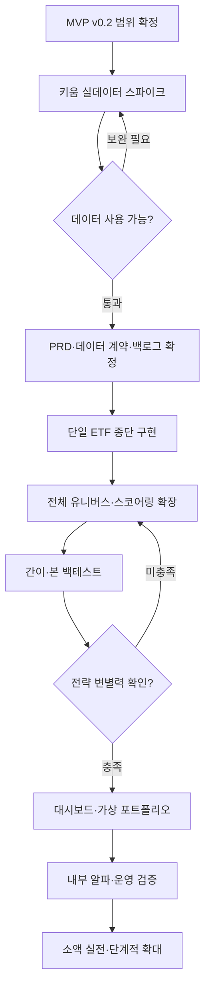

# ETF 투자 가이드 MVP 이후 진행 흐름 v0.1

> 기준 문서: `ETF 투자 가이드 MVP 계획 v0.2.md`\
> 목적: 확정된 MVP 계획을 실제 개발·검증·실전 운용으로 전환하기 위한 실행 흐름 정의

---

## 1. 결론

MVP 계획 확정 후에는 바로 전체 기능 개발에 들어가기보다 다음 순서로 진행한다.

1. **키움 실데이터 스파이크**
2. **PRD·데이터 계약·개발 백로그 확정**
3. **단일 ETF 종단 구현**
4. **한국·미국 ETF 전체 유니버스 확장**
5. **간이 백테스트를 통한 스코어카드 조기 검증**
6. **Scanner·Radar·리서치·투자 규칙 구현**
7. **3~5년 롤링 백테스트**
8. **대시보드·가상 포트폴리오 구축**
9. **내부 알파 및 8~12주 운영 검증**
10. **소액 실전 → 단계적 투자금 확대**

현재 가장 먼저 실행해야 할 작업은 **`M0 — Kiwoom API Reality Check`**이다. 키움 CLI가 설치·검증되었더라도 실데이터의 범위·정확도·연속조회·수정주가·환율·분배금 데이터가 확인되기 전에는 데이터베이스와 화면 구조를 확정하지 않는다.

---

## 2. 전체 진행 구조

---

## 3. 0단계: MVP 범위 동결

8주 개발기간 동안 다음 범위를 기준선으로 유지한다.

- 한국·미국 ETF 전체시장 Scanner
- Momentum Acceleration과 Oversold Recovery 스코어카드 분리
- Emerging Radar와 초기 Core 6 산업군 운영
- 주간 Top 3 및 `신규·유지·강화·관찰·약화·제외` 상태 제공
- 원화 환산 총수익률 기준 성과 계산
- 가상 포트폴리오와 3~5년 롤링 백테스트
- PDF·Excel·CSV 중심의 반자동 리서치 Inbox
- 자동매매 제외
- 레버리지·인버스 ETF 기본 추천 대상 제외

다음 기능은 MVP 핵심 경로에서 제외하거나 후속 단계로 관리한다.

- OpenDART 자동 연계
- 뉴스·수출입·수주·재고 데이터의 완전 자동수집
- HTS 화면 스크래핑 기반 자동화
- 실계좌 자동 주문
- 복잡한 AI 에이전트 기반 투자 판단

기능 추가 요청은 즉시 구현하지 않고 `Post-MVP` 백로그에 기록한다.

---

## 4. 1단계: 키움 실데이터 Reality Check

### 4.1 우선 검증 API

| 데이터           | 국내 ETF             | 미국 ETF                    |
| ---------------- | -------------------- | --------------------------- |
| 인증             | `au10001` 접근토큰   | 동일 인증체계 확인          |
| ETF 목록         | `ka10099`, `ka40004` | `usa10104`                  |
| 분류·카테고리    | 추적지수·종목정보    | `usa10105`                  |
| ETF 상세정보     | `ka40002`            | 미국 종목정보 API           |
| 일별 가격·거래량 | `ka40003`, `ka10081` | `usa06012`                  |
| 기간 수익률 참고 | `ka40001`            | `usa20511`                  |
| 산업·업종 보조   | `ka20003`, `ka20006` | `usa23000`                  |
| 리서치 보조      | 다운로드 파일        | `usa24300` 및 다운로드 파일 |

API가 제공하는 수익률은 참고값으로 저장하고, 공식 성과와 순위는 일별 가격·환율·분배금 데이터를 이용해 자체 계산한다.

### 4.2 검증 항목

- 실계정 접근토큰 발급·만료·재발급
- 국내·미국 ETF 목록과 ETF·ETN 구분
- 한·미 ETF 각 5개 이상의 실제 일봉 수집
- `cont-yn`, `next-key` 연속조회
- 호출 제한, 타임아웃, 재시도, 중복 요청 처리
- 수정주가 적용 전후 비교
- 가격·거래량·거래대금 필드의 부호와 문자열 변환
- 미국 ETF 거래소 코드와 환율 적용 방식
- 분배금 데이터의 제공 범위와 보조 소스 필요 여부
- 휴장일·결측일·이상치 처리
- Mock API와 실데이터 응답의 차이
- 키움 값과 KRX·공개 미국 시세의 표본 대조

### 4.3 통과 Gate

- 한·미 ETF 각 5개 이상의 목록·일봉 데이터 수집 성공
- 원본 응답과 정규화 결과를 함께 저장 가능
- 동일 종목·동일 기간 재수집 시 중복 없이 갱신 가능
- 연속조회와 재시도 동작 확인
- 외부 보조 소스와의 주요 가격 차이가 설명 가능
- 확인되지 않은 필드는 데이터 계약에서 제외하거나 `nullable`로 명시

Reality Check가 통과되지 않으면 UI 본개발을 시작하지 않는다.

---

## 5. 2단계: PRD·데이터 계약·개발 백로그 확정

실데이터 검증 결과를 기반으로 `PRD v1.0`과 데이터 계약을 확정한다.

### 5.1 최소 데이터 구조

| 테이블                | 역할                                             |
| --------------------- | ------------------------------------------------ |
| `etf_master`          | 종목코드, 시장, 이름, 카테고리, ETF 유형, 상장일 |
| `etf_prices_daily`    | 일자, OHLC, 거래량, 거래대금, 수정주가 상태      |
| `fx_rates_daily`      | 통화, 기준일, 원화 환율, 출처                    |
| `etf_distributions`   | 분배금, 기준일, 지급일, 출처와 조정 상태         |
| `etf_signals_daily`   | 상대강도, 모멘텀, 낙폭, 거래량·수급 신호         |
| `etf_rankings_weekly` | 전략, 점수, 퍼센타일, 순위와 상태 변화           |
| `research_documents`  | 문서 해시, 발행일, 산업, 출처, `as_of`           |
| `investment_theses`   | Thesis, Trigger, Risk, Invalidation              |
| `paper_portfolio`     | 가상 진입·추가매수·축소·성과 기록                |
| `collection_jobs`     | 실행 시점, 상태, 실패 원인, 재시도 결과          |

### 5.2 반드시 버전 관리할 항목

- `strategy_version`
- `universe_filter_version`
- 스코어카드 배점
- 퍼센타일 컷
- 벤치마크 혼합 비중
- 상관계수·구성종목 중복 한도
- 환율·분배금·수정주가 계산 방식

동일 데이터와 동일 버전에서는 동일한 순위가 재현되어야 한다.

---

## 6. 3단계: 단일 ETF 종단 구현

전체 ETF를 한 번에 처리하지 않고 대표 ETF 하나로 다음 흐름을 먼저 완성한다.

> API 호출 → Raw 저장 → 정규화 → 원화 환산 → 지표 계산 → 점수 산출 → Thesis·Trigger 기록 → 화면 표시

종단 구현에서 확인할 사항은 다음과 같다.

- 실패한 단계부터 안전하게 재실행 가능
- 원본 데이터와 계산 결과 추적 가능
- 모든 결과에 `as_of` 시점 기록
- 계산에 사용된 전략 버전 기록
- 미래 데이터 참조 방지
- 데이터가 오래되거나 불완전하면 추천 생성 차단

단일 종목 종단 흐름이 안정된 후 한국·미국 각 20~30개 소규모 유니버스로 확대한다.

---

## 7. 4단계: 간이 백테스트와 스코어카드 검증

2주차에 소규모 유니버스로 간이 백테스트를 먼저 실시한다. 목적은 수익 극대화가 아니라 스코어카드의 기본적인 변별력 확인이다.

검증 대상:

- Momentum과 Oversold 스코어카드가 서로 다른 후보를 구분하는가
- 상위 퍼센타일 후보가 벤치마크 대비 차이를 보이는가
- 거래량·유동성 필터가 지나치게 많은 ETF를 제외하지 않는가
- 원화 환산과 환율 기여도 분리가 정상인가
- 점수 변동이 단순 가격 등락을 그대로 복제하지 않는가
- 특정 시장·산업·기간에만 맞춘 규칙은 아닌가

간이 백테스트에서 변별력이 확인되지 않으면 UI나 리서치 기능보다 스코어카드와 데이터 입력을 먼저 수정한다.

---

## 8. 5단계: 전체 Scanner·Radar·Top 3 구현

### 8.1 전략별 스캐너

1. **Momentum Acceleration**
   - 1·3·6개월 상대강도
   - 수익률 가속
   - 거래량·거래대금 증가
   - 과열 위험 감점

2. **Oversold Recovery**
   - 52주 고점 대비 낙폭
   - 하락 둔화와 추세 반전
   - 거래량·수급 안정
   - 구조적 훼손 위험 감점

3. **Emerging Radar**
   - 산업 상대강도 전환
   - 리서치 증가
   - 수출·수주·CAPEX 개선
   - 승격·강등 조건

### 8.2 순위 고착 대응

순위가 매주 같다는 이유로 신규 종목을 억지로 교체하지 않는다.

- `Top 3`: 현재 절대 점수가 높은 후보
- `Challenger`: 차순위 후보
- `Rising`: 점수 증가 속도가 빠른 상승 초기 후보
- `Dropped`: Thesis 또는 신호가 약화된 기존 후보
- 상태: `신규 / 유지 / 강화 / 관찰 / 약화 / 제외`

Top 3가 유지되더라도 점수 변화, Challenger와의 격차, Trigger 충족 여부를 함께 제공한다.

---

## 9. 6단계: 본 백테스트

본 백테스트는 다음 기준으로 실시한다.

- 기간: 3~5년
- 2022년 등 하락장 구간 포함
- 가능한 범위에서 상장폐지 ETF 포함 여부 명시
- 원화 환산 총수익 기준
- 분배금 재투자 가정
- KOSPI200 50% + S&P500 원화 환산 50% 혼합지수와 비교
- 거래비용 반영 전·후 성과 분리
- 미래 정보가 포함되지 않도록 `as_of` 기준 적용
- 스코어카드·유니버스·벤치마크 버전별 결과 분리

핵심 검증 항목:

- 벤치마크 대비 초과성과
- 최대낙폭과 회복기간
- Top 3 교체 빈도와 거래비용
- Momentum과 Oversold 전략별 성과
- 산업·시장·환율 의존도
- 퍼센타일 컷과 필터 수치 민감도
- 상관계수·구성종목 중복 제한 효과
- DATA·SIGNAL·THESIS·EXECUTION·EXTERNAL 오판 원인

백테스트 결과가 좋다는 이유만으로 즉시 실투자로 전환하지 않는다. 과최적화 가능성을 검토하고 전향검증을 별도로 실시한다.

---

## 10. 7단계: 대시보드와 가상 포트폴리오

구현 우선순위는 다음과 같다.

1. 데이터 수집 상태와 오류
2. Scanner와 전략별 순위
3. Weekly Guide와 Top 3 상태 변화
4. ETF Detail과 Thesis·Trigger·Invalidation
5. Paper Portfolio
6. Backtest Report
7. Research Inbox
8. Emerging Radar 확장 화면

화면보다 먼저 데이터 상태를 노출해야 한다. 데이터 수집 실패·오래된 시세·보조 소스 불일치가 있으면 해당 주 추천 발행을 보류한다.

---

## 11. 8주 개발 일정

| 주차  | 목표                               | 완료 기준                                  |
| ----- | ---------------------------------- | ------------------------------------------ |
| 1주차 | 실데이터 스파이크·PRD v0.1         | 한·미 ETF 각 5개 실제 데이터 수집          |
| 2주차 | ETF 마스터·산업 분류·간이 백테스트 | 한·미 각 20~30개로 스코어카드 방향성 확인  |
| 3주차 | 가격·환율 파이프라인               | 일별 수집·원화 환산·재시도·이상치 플래그   |
| 4주차 | Scanner·Radar                      | 전략별 점수와 퍼센타일 컷 산출             |
| 5주차 | Research Inbox                     | 파일 중복 제거·산업 분류·`as_of` 기록      |
| 6주차 | 투자 규칙·본 백테스트              | 3~5년 롤링 백테스트와 위험규칙 검증        |
| 7주차 | 대시보드·가상 포트폴리오           | Top 3와 성과·환율·분배금 기여도 화면       |
| 8주차 | QA·내부 알파                       | 오류복구·재현성·시점 정합성·보조 소스 대조 |

2주차 간이 백테스트에서 변별력이 확인되지 않으면 4주차 이후 일정을 고정적으로 진행하지 않고 스코어카드와 입력 데이터를 먼저 재설계한다.

---

## 12. 내부 알파와 전향검증

### 12.1 내부 알파

내부 알파에서는 투자수익보다 시스템의 정확성과 재현성을 검증한다.

- 데이터 결측·중복·이상치
- 수정주가·분배금·환율 계산 오류
- 미래 데이터 참조
- 생존편향과 상장폐지 ETF 처리
- 주간 추천 생성 시점 정합성
- 동일 데이터·동일 버전의 순위 재현
- 수집 실패 후 재시도·복구
- 레버리지·인버스 ETF 제외

### 12.2 8~12주 운영 검증

전략을 과거 결과에 맞춰 계속 수정하지 않고 앞으로 들어오는 데이터로 가상 포트폴리오를 운영한다.

매 추천 시점에 다음을 변경 불가능한 형태로 기록한다.

- 전략과 점수
- 선정 이유와 산업 Thesis
- 진입·추가매수 Trigger
- 주요 Risk와 Invalidation
- 추천 당시 데이터 기준일
- 1·2·4·8주 후 성과
- 최대 상승폭·최대 낙폭
- 벤치마크 대비 상대성과
- 오판 원인 코드

8~12주는 시스템 운영 안정성 검증이고, 전략 유효성은 최소 6개월 이상의 전향검증과 함께 판단한다.

---

## 13. 실투자 전환 단계

| 단계          |      투자 규모 | 전환 조건                                      |
| ------------- | -------------: | ---------------------------------------------- |
| 개발·백테스트 |            0원 | 3~5년 롤링 백테스트와 위험 기준 충족           |
| 운영 검증     |            0원 | 8~12주 가상 포트폴리오 안정화                  |
| 소액 실전     |   최대 300만원 | 수집·신호·기록 안정화 및 세후 성과 재계산 통과 |
| 중간 확대     |   최대 600만원 | 규칙 준수와 위험통제 확인                      |
| 전체 운용     | 최대 1,000만원 | 최소 6개월 전향검증 후                         |

실전 운용 시 기존 위험 규칙을 유지한다.

- ETF당 최대 비중 30%
- 미국 ETF 합산 비중 최대 60%
- 최소 현금 비중 10%
- ETF별 기본 위험 한도 약 8%
- 포트폴리오 -8%에서 신규매수 보류
- -10%에서 전 포지션·Thesis 재검토
- -15%에서 위험자산 비중 50% 이하 축소
- -20%에서 Hard Stop

자동매매는 별도 프로젝트로 평가하기 전까지 추가하지 않는다.

---

## 14. 운영 Go/No-Go Gate

### Gate 1 — 데이터

- 국내·미국 ETF 수집 성공률 95% 이상
- 보조 소스 표본 대조 불일치율 1% 이하
- 3영업일 이상 결측 자동 탐지
- 데이터 이상 시 추천 발행 차단

### Gate 2 — 재현성

- 동일 데이터·동일 규칙·동일 버전에서 동일 결과
- 모든 추천에 `as_of`와 전략 버전 기록
- 과거 추천 결과의 사후 변경 차단

### Gate 3 — 전략

- 간이·본 백테스트에서 후보 변별력 확인
- 하락장 포함 기간에서 위험 규칙 작동
- 벤치마크·최대낙폭·교체비용 기준 검토

### Gate 4 — 운영

- 8~12주 동안 정기 수집과 주간 추천 안정화
- 오류 발생 시 원인·재시도·복구 기록
- DATA·SIGNAL·THESIS·EXECUTION·EXTERNAL 분류 가능

### Gate 5 — 실전

- 세금·매매비용 반영 후 성과 재계산
- 소액 실전에서 분할매수·손실한도 준수
- 최소 6개월 전향검증 후 전체 자금 확대 여부 결정

---

## 15. Linear 실행 구조

권장 마일스톤은 다음과 같다.

| 마일스톤                 | 목표                              |
| ------------------------ | --------------------------------- |
| M0 — API Reality Check   | 실데이터 범위와 한계 확정         |
| M1 — Data Foundation     | ETF·가격·환율·분배금 파이프라인   |
| M2 — Strategy Validation | 간이 백테스트와 스코어카드 검증   |
| M3 — Scanner & Research  | Scanner·Radar·Research Inbox      |
| M4 — Backtest & Risk     | 본 백테스트와 투자·위험 규칙      |
| M5 — Product Alpha       | 대시보드·가상 포트폴리오·QA       |
| M6 — Forward Validation  | 8~12주 운영 검증과 실전 전환 Gate |

모든 이슈에는 다음 항목을 포함한다.

- 목적과 사용자 가치
- 입력·출력 데이터
- Acceptance Criteria
- 실패·결측·재시도 조건
- 테스트 방법
- 관련 전략·유니버스 버전
- 완료 증거와 로그 위치

---

## 16. 지금 실행할 단 하나의 다음 행동

Linear에 **`M0 — Kiwoom API Reality Check`** 마일스톤을 생성하고 첫 주에 다음 결과물을 완성한다.

1. 한·미 ETF 각 5개 실데이터 수집 결과
2. API별 요청·응답 샘플과 데이터 필드 매핑표
3. 연속조회·수정주가·환율·분배금 검증 결과
4. 확인된 제약과 보조 데이터 소스 필요 목록
5. PRD v1.0에서 확정하거나 수정할 Open Questions

이 Gate가 통과된 다음에 Supabase 스키마와 전체 개발 백로그를 확정한다.

---

## 참고 자료

- `ETF 투자 가이드 MVP 계획 v0.2.md`
- `kiwoom-rest-api-spec.json`
- `키움 REST API 문서.xlsx`
